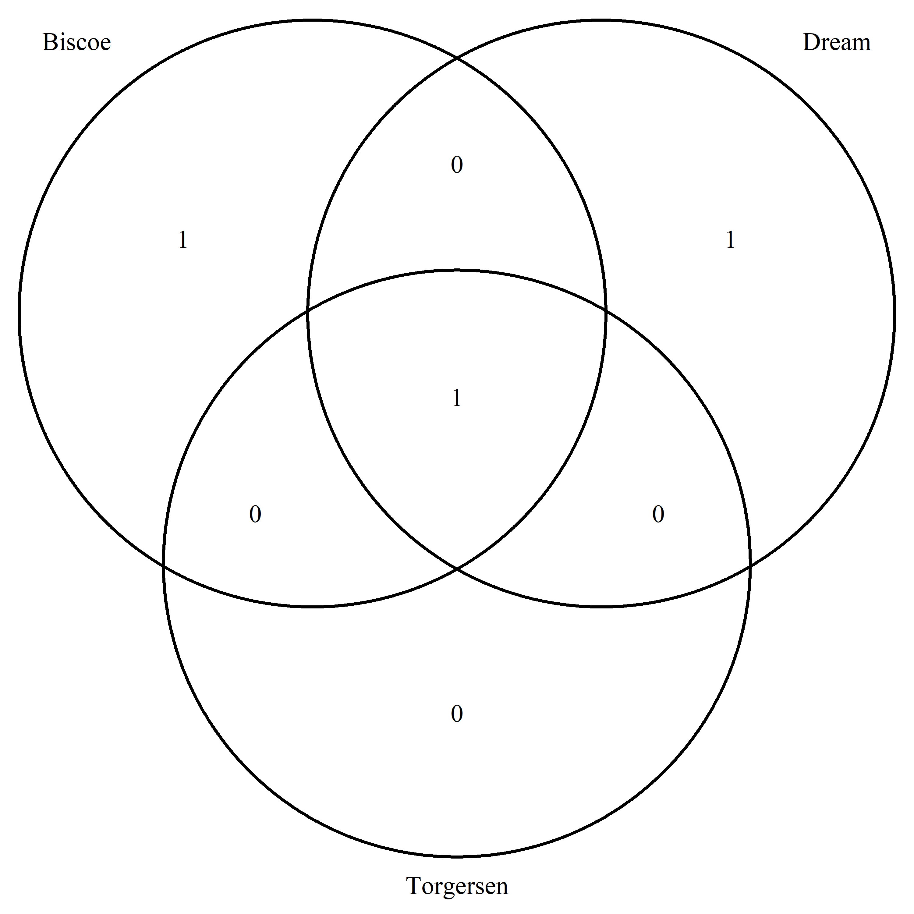

```{r setup, include=FALSE}
knitr::opts_chunk$set(echo = TRUE, message = FALSE, warning = FALSE)
```

# Introduction à R 
## Fonctionnement de R  
`R` est un langage open-source de programmation orienté objet, développé par et pour les statisticien.ne.s.  
Il fonctionne grâce à des fonctions (toujours suivis de parenthèses dans ce support comme `plot()`) paramétrables grâce à des arguments. Les fonctions sont réunis dans des packages (ici écrit entre `{}`, *par exemple* `{tidyverse}`).  
Certains packages sont téléchargés de base dans `R`, les autres sont à installer depuis le [`CRAN`](https://cran.r-project.org/) ou depuis d'autres sources.  
Pour pouvoir utiliser les fonctions contenues dans un package il faut le charger dans l'environnement en utilisant `library(nom_du_package)`.  
  
## RStudio  
Pour bien travailler avec R, il est indispensable d'utiliser RStudio comme IDE.  
Pour installer RStudio, il faut commencer par [installer R](https://cran.r-project.org/), puis [RStudio](https://posit.co/download/rstudio-desktop/).  
    
Le `cheatsheet` de RStudio en tant qu'IDE est téléchargeable via [les ressources de posit](https://posit.co/resources/cheatsheets/).  
  
**Attention** : Pour toutes les personnes travaillant sous **Windows**, il faut aussi installer `Rtools`.  
  
```{r installation_r_tools, eval=FALSE}

install.packages("utils")
install.packages("installr")
installr::install.Rtools()

```
  
## RMarkdown  
### La base   
La syntaxe et la structure des rapports générés avec `Rmarkdown` permettent de faciliter la **maintenance** et la **mise à jour** des codes réalisés. En effet, `Rmarkdown` est conçu pour permettre l'**automatisation** et la **réutilisation de code**. Un bon développement fait gagner du temps par la suite.  
  
Le `Rmarkdown` est un type de fichier qui permet d'organiser le code (R mais aussi Python, SQL...) **sous forme de blocs** avec du **texte** et des **sorties** (graphiques, tableaux...).  
Il est aussi possible d'intégrer des images, des liens vers des fichiers extérieurs ou des pages web : `` ou `[texte_a_afficher](adresse_page_web)`.  
  
  
Le `cheatsheet` de `Rmarkdown` est téléchargeable via [les ressources de RStudio](https://rmarkdown.rstudio.com/lesson-15.html).  

### Syntaxe en `Rmarkdown`  
Le fichier rédigé en `Rmarkdown` est différent de la sortie finale (`.docx`, `.html`, `.pdf`...) qui est "tricotée" (`knit` en anglais). Il faut donc utiliser un codage spécifique pour mettre en forme le texte.  
  
Les titres sont caractérisés par des `#` en fonction du niveau : `#Titre de niveau 1`, `##Titre de niveau 2`...  
    
La mise en forme du texte se fait avec les étoiles ou les `` :  
  
* Une étoile `*` avant et après la partie à valoriser permet de mettre en *italique* (codé `*italique*`)  
* Deux `**` avant et après mettent en **gras** (codé `**gras**`)    
* Un **double espace** `  ` permet de passer à la ligne. Il faut donc toujours mettre deux espaces à la fin de chaque ligne. Sans ces espaces, toutes les lignes sont collées les unes à la suite des autres.    
* Pour éditer un `format code` (sans qu'il se lance) pour présenter les packages, les fonctions ou les objets utilisés (comme fait dans ce document), il faut encadrer d'impostrophes  
  
Le format `Rmarkdown` fait la part belle au texte alors que le code doit être spécifié. 
Le code apparaît soit dans des `chunks` (morceaux en anglais) qui commencent et terminent avec 3 signes accents graves (ou impostrophe) qu'on peut générer avec `Ctrl+ Alt + I`, soit mis dans le texte sur une ligne entouré d'impostrophes.  
Dans les deux cas, il faut toujours écrire au début le langage utilisé (donc r).    
*Par exemple* : La largeur moyenne des sépales du jeu de données iris est `r round(mean(iris$Sepal.Length), digits = 2)`.  
  
## Le `{tidyverse}`  
Le `{tidyverse}` s'appelait encore le `hadleyverse` il y a quelques année,  c'est-à-dire `l'univers de Hadley` pour [Hadley Wickham](https://hadley.nz/) son génial créateur.  
Le but de Hadley est de rendre l'analyse données plus facile, plus rapide et surtout **plus fun** et je trouve que cela transparaît dans ses packages !  
Le `{tidyverse}` c'est l'ensemble des packages open-source développé par Hadley et son équipe (Hadley travaille maintenant pour RStudio en plus de plusieurs universités) qui partagent la même philosophie, la même structure de données (le fameux format `tidy`) et la même syntaxe.  
  
Les packages concernés :  

_ [`ggplot2`](https://ggplot2.tidyverse.org/) : Visulisation des données  
_ [`dplyr`](https://dplyr.tidyverse.org/) : Manipulation des données (filtrer, trier,...) à ne pas confondre avec `tidyr` qui manipule le format du jeu de données. Présenté [le 7 février sur twitch](https://www.twitch.tv/videos/1730949759).   
_ [`tidyr`](https://tidyr.tidyverse.org/) : Modification du format du jeu de données pour en faire un jeu de donnée `tidy`. Présenté [le 7 février sur twitch](https://www.twitch.tv/videos/1730949759).    
_ [`readr`](https://readr.tidyverse.org/) : Lecture rapide de fichiers de données format `csv` et autres. **Attention** : format `xslx` non pris en charge, il faut utiliser le package [`readxl`](https://readxl.tidyverse.org/) qui fait partie du `tidyverse` au sens large mais qui n'est pas attaché par défaut quand on fait `library(tidyverse)`   
_ [`purrr`](https://purrr.tidyverse.org/) : Permet le remplacement d'un grand nombre de boucles. Présenté [le 2 mai sur twitch](https://www.twitch.tv/videos/1809466535).    
_ [`tibble`](https://tibble.tidyverse.org/) : Format des données `tidy`  
_ [`stringr`](https://stringr.tidyverse.org/) : Manipulation des chaînes de caractères. Présenté [le 21 mars sur twitch](https://www.twitch.tv/videos/1774056539).     
_ [`forcats`](https://forcats.tidyverse.org/) : Manipulation des variables facteurs `factors`. Présenté [le 21 mars sur twitch](https://www.twitch.tv/videos/1774056539).     
_ [`lubrdate`](https://lubridate.tidyverse.org/) : Manipulation des dates. *Nouveau dans le `{tidyverse}`*  
  
## Oubli : Import et export de fichiers  
Lors de la [séance de mercredi 7 juin](https://www.mq-datascience.com/fr/tutorials/) j'ai oublié de parler de l'import et l'export des fichiers !  
Contrairement à ce qui se fait classiquement je vais enregistrer des fichiers dans le sous-dossier `data` pour les réimporter afin que c'est lignes de codes soit réutilisables par tou.te.s.  

### Création d'un dossier `data`  
Possible en cliquant sur `New Folder` ou grâce à la fonciton `dir.create()` du package `{base}`.  
```{r creation_dossier_data}

dir.create("data", showWarnings = FALSE)

```
  
### Enregistrer un fichier  
#### Fichier `.csv`
Création un fichier `.csv` à partir du jeu de données `mtcars` grâce à la fonction `write.csv()` du package `{utils}`.  
```{r creation_csv}

write.csv(
  mtcars, 
  "data/jdd_voiture.csv"
  )

```
  
#### Fichier `.xlsx`  
Création un fichier `.xlsx` à partir du jeu de données `women` grâce à la fonction `write.xlsx()` du package `{openxlsx}`.   
Il n'y a pas de fonction présente de base pour importer un fichier `.xlsx`.  
```{r creation_excel}

library(openxlsx)

write.xlsx(
  women, 
  "data/jdd_femme.xlsx"
  )

```
  
#### Web-scrapping  
Il est possible de récupérer facilement des données sur une page internet grâce au package `{rvest}`.  
*Par exemple* : Importer le titre des lettres de la contesse de Ségur à partir de [Wikisource](https://fr.m.wikisource.org/wiki/Lettres_de_la_comtesse_de_S%C3%A9gur/Texte_entier) grâce aux fonctions du package `{rvest}`.  
```{r lecture_donnees_site_internet}

library(rvest)
(page <- read_html("https://fr.m.wikisource.org/wiki/Lettres_de_la_comtesse_de_S%C3%A9gur/Texte_entier") %>% 
  html_nodes("h1") %>% 
  html_text())

```
  
### Import d'un fichier  
#### Lecture d'un `.csv`
Import du fichier `.csv` créé grâce à la fonction `read.csv()` du package `{utils}`.  
Le nom des lignes est stocké par défaut dans la première colonne `X`.  
```{r lecture_csv}

jdd_voiture <- read.csv(
  file = "data/jdd_voiture.csv",
  row.names = "X"
)

```
  
#### Lecture d'un `.xlsx`  
Import du fichier `.xlsx` à partir du jeu de données `women` grâce à la fonction `read.xlsx()` du package `{openxlsx}`.  
```{r lire_excel}

jdd_femme <- read.xlsx(
  "data/jdd_femme.xlsx"
)

```
  
  
# Analyse descriptive 
Utilisation du jeu de données `penguins` du package `{palmerpenguins}` qui recense les caractéristiques des pingouins de l'archipel de Palmer. Plus d'informations sur ce jeu de données dans la page d'aide `help(penguins)`.  

## visualisation rapide des données  
Avec la fonction très généraliste `plot()` chargée de base dans l’environnement.  
```{r visualiser_les_donnnes}
# nécessité d'importer le package pour utiliser le jeu de données
library(palmerpenguins)

penguins

# View(penguins)

plot(penguins)

```

Pour avoir un appercu des données il est interressant d'utiliser la fonction `summary()` présent dans le package `{base}`.  
```{r resume_des_donnees}

summary(penguins)

```
  
Il y a des valeurs manquantes, il faut donc les visualiser.  
[`{naniar}`](http://naniar.njtierney.com/) est un package très performant pour travailler sur les données manquantes.  
```{r visualiser_les_donnnees_manquantes}

naniar::gg_miss_upset(penguins)

```
  
Pour visualiser différement le tableau de données, il est possible d'utiliser la fonction `glimpse()` du `{tidyverse}`. Plus d'information sur le `{tidyverse}` dans l'onglet [Le `{tidyverse}`](#Le-`{tidyverse}`).  
```{r visualiser_le_tableau_de_donnees}

library(tidyverse)

glimpse(penguins)

pingouins <- penguins
# le jeu de données est chargé dans l'environnement et visible en haut à droite
```

**Attention** le chargement de certain package remplace des fonctions déjà chargées par celles chargée en dernière.  
*Par exemple, le chargement du package `{tidyverse}` ou `{dplyr}` remplace la fonction `filter()` du package `{stat}` par la sienne.* 
  
## Analyse univariée  
### Variable qualitative  
Il y a trois variables qualitatives ici :  `species`, `island` et `sex`.  
Toutes les trois sont finis -> donc on peut réaliser directement des tableaux de contingence.  

#### Tableau de contingence  
```{r tableau_de_contingence}
# fonction `table()` du package `{base}`
table(pingouins$species)
table(pingouins$island)
table(pingouins$sex)
# ne permet pas de voir les NA !

count(pingouins, sex)

```
  
#### Petit apparté sur le **pipe**  
Le **pipe** est une syntaxe qui permet d’enchaîner les opérations sur un même objet.  
Plus d'information dans [le guide-R de Joseph Larmarange](https://larmarange.github.io/guide-R/manipulation/pipe.html) et [cet article de blog de Lise Vaudor](https://perso.ens-lyon.fr/lise.vaudor/utiliser-des-pipes-pour-enchainer-des-instructions/) (c'est sur le pipe de `{magrittr}` et non le pipe natif présenté ici mais le fonctionnement est le même).  
  
```{r pipe}

# sans pipe
mean(sqrt(c(1:10)*2))

# avec pipe
(c(1:10)*2) |> 
  sqrt() |> 
  mean()

```
  
#### Représentation graphique  
Ressource conseillée pour la réalisation de graphiques : [From Data to Viz](https://www.data-to-viz.com/).  
```{r representation_graphique}

# diagramme en barre
pingouins |>
  # filter(species == "Adelie") |> 
  ggplot() +
  aes(x = island, fill = species) +
  geom_bar() +
  theme_bw()

# diagramme circulaire
pingouins |> 
  count(sex) |> 
  ggplot() +
  aes(x = "", y = n, fill = sex) +
  geom_bar(stat = "identity") +
  coord_polar("y") +
  theme_void()

couleur <- c("female" = "yellow", "male" = "blue")

pingouins |> 
  count(sex) |> 
  ggplot() +
  aes(x = "", y = n, fill = sex) +
  geom_bar(stat = "identity") +
  coord_polar("y") +
  scale_fill_manual(values = couleur) +
  theme_void()

```
  
### Variable quantitative  
Il y a 5 variables quantitatives, il est possible d'étudier leurs dispersion grâce aux histogrammes ou de calculer les mesures de cette dispersion.  

#### Histogramme  
**Attention** au nombre d'intervalles représenté.  
```{r histogramme}

pingouins |> 
  ggplot() +
  aes(x = bill_length_mm) +
  geom_histogram() +
  theme_classic()

# changement nombre d'intervalles (10)
pingouins |> 
  ggplot() +
  aes(x = bill_length_mm) +
  geom_histogram(bins = 10) +
  theme_classic()

# largeur de la barre
pingouins |> 
  ggplot() +
  aes(x = bill_length_mm) +
  geom_histogram(binwidth = 10) +
  theme_classic()

```
  
#### Calcul des mesures de dispersion  
```{r mesures_dispersion}

summary(penguins)

mean(pingouins$bill_depth_mm)
# NA car présence de valeur manquantes

mean(pingouins$bill_depth_mm, na.rm = TRUE)

max(pingouins$bill_length_mm, na.rm = TRUE)

# création d'un jeu de données sans valeurs manquantes (suppression des lignes avec NA)
pingouins <- 
  penguins |> 
  drop_na()

median(pingouins$flipper_length_mm)

pingouins |> 
  summarise(
    across(
      .cols = where(is.numeric),
      .fns = list(
        moyenne = ~ mean(.x),
        minimum = ~ min(.x),
        maximum = ~ max(.x)
      ),
      .names = "{col}_{fn}"
    )
  ) |> 
  pivot_longer(everything())

```

#### Boîte à moustaches  
Graphique généralisant les données de dispersion.  
```{r boite_a_moustaches}

penguins |> 
  ggplot() +
  aes(y = bill_length_mm) +
  geom_boxplot() +
  theme_light()

# sur toutes les colonnes numériques
penguins |> 
  pivot_longer(
    cols = where(is.numeric)
  ) |> 
  ggplot() +  
  aes(y = value) +
  facet_wrap(~ name, scales = "free_y") +
  geom_boxplot() +
  theme_grey()

```
  
## Analyse bivariée  
### Deux variables quantitatives  
#### Nuage de points  
Il faut **toujours commencer** par la représentation graphique !  
```{r nuage_de_points}
penguins |> 
  ggplot() +
  aes(x = bill_length_mm, y = bill_depth_mm) +
  geom_point()+
  theme_linedraw()

# l'influence du sex
penguins |> 
  ggplot() +
  aes(x = bill_length_mm, y = bill_depth_mm, color = species) +
  geom_point()+
  geom_smooth(method ="lm") +
  theme_linedraw()

```

#### Réalisation d'une régression linéaire  
```{r regression_lineaire}

modele_lineaire <- lm(
  bill_depth_mm ~ bill_length_mm, 
  data = penguins |> filter(species == "Adelie")
  )
summary(modele_lineaire)

# autre exemple
penguins |> 
  ggplot() +
  aes(y = flipper_length_mm, x = body_mass_g) +
  geom_point()

modele_lineaire_nageoire <- 
  lm(
    flipper_length_mm ~ body_mass_g, 
    data = penguins
    )
summary(modele_lineaire_nageoire)

# Représentation graphique
penguins |> 
  ggplot() +
  aes(y = flipper_length_mm, x = body_mass_g) +
  geom_point() +
  geom_abline(
    aes(
      intercept = modele_lineaire_nageoire$coefficients[1], 
      slope = modele_lineaire_nageoire$coefficients[2]), 
    colour = "red"
    ) + 
  theme_linedraw()

# ou automatiquement
penguins |> 
  ggplot() +
  aes(y = flipper_length_mm, x = body_mass_g) +
  geom_point() +  geom_abline(
    aes(
      intercept = modele_lineaire_nageoire$coefficients[1], 
      slope = modele_lineaire_nageoire$coefficients[2]), 
    colour = "red"
    ) + 
  geom_smooth(method = "lm") + 
  theme_linedraw()

```
  
### Deux variables qualitatives  
#### Tableau de contingence  
```{r tableau_contingeance_bi}
penguins |> 
  count(species, island)

```

#### Carte des points chauds  
```{r carte_point_chaud}

penguins |> 
  count(species, island) |> 
  ggplot() +
  aes(x = species, y = island, fill = n) +
  geom_tile() +
  theme_bw()

```
  
#### Diagramme de Venn  
```{r diagramme_venn, eval=FALSE}
# diagramme de Venn
library(VennDiagram)
venn.diagram(
  x = map(
      .x = penguins$island |> levels(),
      .f = ~ penguins |> 
        filter(island == .x) |> 
        select(species) |> 
        unlist()
    ),
  category.names = penguins$island |> levels(),
  filename = "img/diagramme_venn.png",
  output = TRUE,
  imagetype="png"
)

```
   
Le diagramme de Venn montre qu'une seule espèce est présente sur les trois îles, les deux autres espèces sont chacune présente sur une seule île.  
**Attention** : Impossible de faire une effet croisé de l'île et de l'espèce !  
  
### Une variable qualitative et une quantitative  
Revient à chercher si au moins un des groupes est différent.  
La représentation graphique se fait comme précédemment en ajoutant de la couleur.  
```{r boite_a_moustaches_colore}

penguins |> 
  ggplot() +
  aes(x = bill_length_mm, y = species, color = species) +
  geom_boxplot() +
  theme_minimal()

# attention à la dispersion des points, possible de rajouter un graphique violon
penguins |> 
  ggplot() +
  aes(x = bill_length_mm, y = species, color = species) +
  geom_violin() +
  geom_boxplot() +
  theme_minimal()

# rajout des points en transparance
penguins |> 
  ggplot() +
  aes(x = bill_length_mm, y = species, color = species) +
  geom_violin() +
  geom_boxplot() +
  geom_jitter(alpha = 0.3) +
  theme_minimal()

```
  
#### ANOVA  
Pour l'ANOVA permet de déterminer les différences entre groupes.  
```{r anova}
shapiro.test((penguins |> filter(species == "Adelie"))$bill_length_mm)

# vérification de l'égalité des variances
map(
  .x = penguins$species |> levels(),
  .f = ~ var.test(
    bill_length_mm ~ species, 
    data = penguins |>  filter(species != .x))
  ) |> 
  set_names(penguins$species |> levels())

# anova 
anova <- aov(bill_length_mm ~species, data = penguins)

summary(anova)

# réalisation post-hoc
library(multcomp)
## attention la fonction `select()` du package `{dplyr}` qui permet de sélectionner une ou plusieurs colonnes est masqué au chargement du package `{multcomp}`. Nécessité d'utiliser : `dplyr::select()`
summary(
  glht(anova, linfct = mcp(species = "Tukey"))
)

anova$residuals |> shapiro.test()
```

#### Test de Kruskal Wallis (ANOVA non paramétrique)  
```{r kruskal_wallis}
# non paramétrique
kw <- kruskal.test(bill_length_mm ~species, data = penguins)
kw

# post_hoc

summary(
  PMCMRplus::kwAllPairsNemenyiTest(
    data = penguins,
    bill_length_mm ~species
  )
)

```
  
# Et les données manquantes ?  
Il est possible de faire des imputations des données manquante via une analyse en composantes factorielles (ACP : uniquement quanti, AFM : quanti et quali, ACM : uniquement quali) avec le package `{missMDA}`.    
```{r donnees_manquantes}
library(missMDA)

# choix d'une ACP pour ne retrouver que les données des deux pingouins non mesurés
pingouin_num <- 
  penguins |> 
  dplyr::select(where(is.numeric))

visdat::vis_miss(pingouin_num)

test_donnees_manquantes <- 
  MIPCA(
    pingouin_num, 
    ncp = estim_ncpPCA(pingouin_num)$ncp
    )

test_donnees_manquantes$res.imputePCA |> summary()

```

  

  
  
# En savoir un peu plus sur moi  
Bonjour, 
  
Je suis Marie Vaugoyeau et je suis disponible pour des **missions en freelance** d’**accompagnement à la formation** à R et à l’analyse de données et/ou en **programmation** (reprise de scripts, bonnes pratiques de codage, développement de package).  
Ayant un **bagage recherche en écologie**, j’ai accompagné plusieurs chercheuses en biologie dans leurs analyses de données mais je suis ouverte à d’autres domaines.  
  
Vous pouvez retrouver mes offres [ici](https://marievaugoyeau.notion.site/MStats-Marie-Vaugoyeau-d69b566c83414152ac85eae012c970fb).  
  
**En plus de mes missions de consulting je diffuse mes savoirs en R et analyse de données sur plusieurs plateformes :**   

- J’ai écrit [un **livre** aux éditions ENI](https://www.editions-eni.fr/livre/langage-r-et-statistiques-initiation-a-l-analyse-de-donnees-9782409036934)  
- Tous les mois je fais [un **live sur Twitch**](https://www.twitch.tv/marievaugoyeau/videos) pour parler d’un package de R, d’une analyse  
- Je rédige une **newsletter** de manière irrégulière pour parler de mes **inspirations** et transmettre **des trucs et astuces sur R**. Pour s’y inscrire, [c’est par là](https://d1154691.sibforms.com/serve/MUIEAGj4fIubg6D4qHb7BoZSxNhzkV4p2L0I7GHpNopbqPeDS1J0SpOgaTDCavroygrDTCukB0La-8s1nsQw5wCANT5UP64en1GudsGbKhGVlwbvP_bJdAJ0ECF9BOZ1swRKEnKlnWzTHpLjknJvrCXiH_xw4F_go_2kVB0dWWrkJzRoE22BXImtgVOu29gBxx2hjFkINdeW7Cae?). J’ai aussi [un **blog**](https://mvaugoyeau.netlify.app/fr/), en PLS en ce moment, qu’il faut que je reprenne.  
  
Pour en savoir encore un peu plus sur moi, il y a [LinkedIn](https://www.linkedin.com/in/marie-vaugoyeau-72ab64153/) et pour retrouver [tous ces liens et plus encore, c'est ici](https://linktr.ee/mstats)  
  
**N’hésitez pas à me contacter sur [marie.vaugoyeau@gmail.com](mailto:marie.vaugoyeau@gmail.com) !**  
  
Bonne journée   

Marie  
